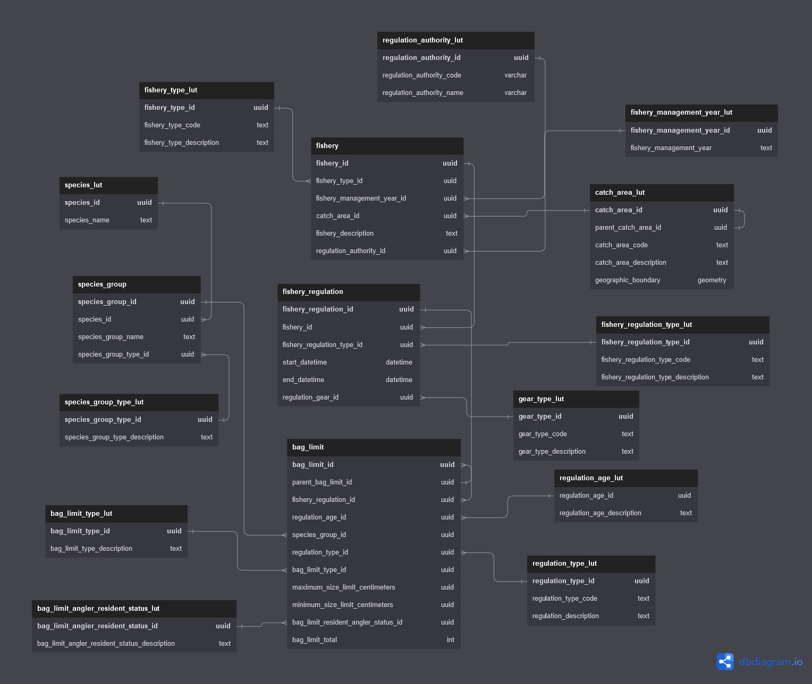

This is a short demonstration of output of regulation data from a proposed 
regulation database for ADFG data. 


# Schema



# Connecting to the database

## Driver

The Windows Postgres driver needs to be installed on the local machine to access this database. The driver can be found [here]( https://www.postgresql.org/ftp/odbc/versions/msi/) 

## Connecting to the database
```{r connect_db}
library(DBI)
# the postgres driver needs to be installed
# connect to database
con <-  DBI::dbConnect( 
               odbc::odbc(),
               driver = "PostgreSQL Unicode",
               database = "postgres",
               server = "34.217.107.216", 
               port = "5433", 
               uid = "ro",
               pwd = "salmon"
               )


```

PostgreSQL's time zone is UTC. Set the locale to the proper timezone for the database session.

```{sql, connection=con}
SET timezone = 'America/Anchorage'
```


# Queries of the database


## Hierachical Catch Areas

The catch_area_lut table has field that allow for self-joins (parent_bag_limit_id). This join allows for a recursive data structure e.g. catch areas within catch areas within catch areas to infinity without loss of the relationship - each catch area knows what its parent catch area is.

Southeast Alaska and its children catch areas
```{sql, connection=con}
with recursive catch_areas as (
select cal.catch_area_description as parent_catch_area,
       null as children_catch_areas
from catch_area_lut cal
where parent_catch_area_id is null
union all
select cal.catch_area_description
    parent_catch_area,
    cal2.catch_area_description children_catch_areas
                               from catch_area_lut cal
                                        join catch_area_lut cal2 on cal.catch_area_id = cal2.parent_catch_area_id
) select * from catch_areas
where parent_catch_area = 'South East Alaska'
```
Puyallup River (Puget Sound) its children catch areas
```{sql, connection=con}
with recursive catch_areas as (
select cal.catch_area_description as parent_catch_area,
       null as children_catch_areas
from catch_area_lut cal
where parent_catch_area_id is null
union all
select cal.catch_area_description
    parent_catch_area,
    cal2.catch_area_description children_catch_areas
                               from catch_area_lut cal
                                        join catch_area_lut cal2 on cal.catch_area_id = cal2.parent_catch_area_id
) select * from catch_areas
where parent_catch_area = 'Puyallup River'
```

## Queries
Dump the regulations for ADFG. This is aimed at being a capture of the regulations on page 9 of [this](https://www.adfg.alaska.gov/static/regulations/fishregulations/PDFs/southeast/2022se_sfregs_complete.pdf) document.

```{sql, connection=con, max.print = NA}
select
    --f.fishery_description,
    fr.start_datetime,
    fr.end_datetime,
    cal.catch_area_description,
    sl.species_group_type_description,
    rtl.regulation_type_code,
    --ral.regulation_authority_code,
    --ra.regulation_age_description,
    bl.minimum_size_limit_centimeters,
    bl.maximum_size_limit_centimeters,
    bltl.bag_limit_type_description,
    blarsl.bag_limit_angler_resident_status_description,
    bl.bag_limit_total--,
    --bl.created_datetime
from
    fishery f
join fishery_regulation fr on f.fishery_id = fr.fishery_id
join bag_limit bl on fr.fishery_regulation_id = bl.fishery_regulation_id
join catch_area_lut cal on f.catch_area_id = cal.catch_area_id
join species_group_type_lut sl on bl.species_group_type_id = sl.species_group_type_id
join regulation_authority_lut ral on f.regulation_authority_id = ral.regulation_authority_id
join regulation_type_lut rtl on bl.regulation_type_id = rtl.regulation_type_id
join regulation_age_lut ra on bl.regulation_age_id = ra.regulation_age_id
join bag_limit_type_lut bltl on bl.bag_limit_type_id = bltl.bag_limit_type_id
join bag_limit_angler_resident_status_lut blarsl on bl.bag_limit_angler_resident_status_id = blarsl.bag_limit_angler_resident_status_id
where
    regulation_authority_code= 'ADFG'
order by f.fishery_description, species_group_type_description;
```
Using the hierarchical properties of catch areas its possible to query a parent or grandparent catch area and return all children and grandchildren areas and their regulations without any preexisting knowledge of those sub areas.

```{sql, connection=con}
with recursive catch_areas as (
select cal.catch_area_description,
       cal.catch_area_id
from catch_area_lut cal
where catch_area_description = 'South East Alaska'
union all
select cal.catch_area_description,
       cal.catch_area_id
from catch_area_lut cal
join catch_areas as c on c.catch_area_id = cal.parent_catch_area_id
)
select
    fr.start_datetime,
    fr.end_datetime,
    cal.catch_area_description,
    sl.species_group_type_description,
    rtl.regulation_type_code,
    bl.minimum_size_limit_centimeters,
    bl.maximum_size_limit_centimeters,
    bltl.bag_limit_type_description,
    blarsl.bag_limit_angler_resident_status_description,
    bl.bag_limit_total
from
catch_areas
join catch_area_lut cal on catch_areas.catch_area_id = cal.catch_area_id
join fishery f on cal.catch_area_id = f.catch_area_id
join fishery_regulation fr on f.fishery_id = fr.fishery_id
join bag_limit bl on fr.fishery_regulation_id = bl.fishery_regulation_id
join species_group_type_lut sl on bl.species_group_type_id = sl.species_group_type_id
join regulation_authority_lut ral on f.regulation_authority_id = ral.regulation_authority_id
join regulation_type_lut rtl on bl.regulation_type_id = rtl.regulation_type_id
join regulation_age_lut ra on bl.regulation_age_id = ra.regulation_age_id
join bag_limit_type_lut bltl on bl.bag_limit_type_id = bltl.bag_limit_type_id
join bag_limit_angler_resident_status_lut blarsl on bl.bag_limit_angler_resident_status_id = blarsl.bag_limit_angler_resident_status_id
```


Bag limits are shared between rows and also have a hierarchical relationship. For example, Coho salmon between Cape Suckling and Cape Fairweather have a daily limit of four fish but a possession limit of twelve fish. This can be queried out as follows:

```{sql, connection=con}
select
    fr.start_datetime,
    fr.end_datetime,
    cal.catch_area_description,
    sl.species_group_type_description,
    rtl.regulation_type_code,
    bl.minimum_size_limit_centimeters,
    bl.maximum_size_limit_centimeters,
    bltl.bag_limit_type_description,
    blarsl.bag_limit_angler_resident_status_description,
    bl.bag_limit_total
from
    fishery f
join fishery_regulation fr on f.fishery_id = fr.fishery_id
join bag_limit bl on fr.fishery_regulation_id = bl.fishery_regulation_id
join catch_area_lut cal on f.catch_area_id = cal.catch_area_id
join species_group_type_lut sl on bl.species_group_type_id = sl.species_group_type_id
join regulation_authority_lut ral on f.regulation_authority_id = ral.regulation_authority_id
join regulation_type_lut rtl on bl.regulation_type_id = rtl.regulation_type_id
join regulation_age_lut ra on bl.regulation_age_id = ra.regulation_age_id
join bag_limit_type_lut bltl on bl.bag_limit_type_id = bltl.bag_limit_type_id
join bag_limit_angler_resident_status_lut blarsl on bl.bag_limit_angler_resident_status_id = blarsl.bag_limit_angler_resident_status_id
where
    regulation_authority_code= 'ADFG' and
    cal.catch_area_description = 'Yakutat Area (between Cape Suckling and Cape Fairweather)' and
    species_group_type_description = 'Coho'
order by f.fishery_description, species_group_type_description;
```
Since bag limits are hierarchical and stored with a relationship to each other it is possible to query for one type of bag limit and have associated bag limits returned.

```{sql, connection=con}
with recursive bag_limits as (
select
    catch_area_description,
    sl2.species_group_type_description species_group_type_description_parent,
    rtl2.regulation_type_code regulation_type_code_parent,
    bltl2.bag_limit_type_description bag_limit_type_description_parent,
    bl2.bag_limit_total bag_limit_parent,
    sl.species_group_type_description species_group_type_description_child,
    rtl.regulation_type_code regulation_type_code_child,
    bltl.bag_limit_type_description bag_limit_type_description_child,
    bl.bag_limit_total bag_limit_parent_child
from
    fishery f
join fishery_regulation fr on f.fishery_id = fr.fishery_id
join bag_limit bl on fr.fishery_regulation_id = bl.fishery_regulation_id
join bag_limit bl2 on bl.parent_bag_limit_id = bl2.bag_limit_id
join catch_area_lut cal on f.catch_area_id = cal.catch_area_id
join species_group_type_lut sl on bl.species_group_type_id = sl.species_group_type_id
join regulation_type_lut rtl on bl.regulation_type_id = rtl.regulation_type_id
join bag_limit_type_lut bltl on bl.bag_limit_type_id = bltl.bag_limit_type_id
join species_group_type_lut sl2 on bl2.species_group_type_id = sl2.species_group_type_id
join regulation_type_lut rtl2 on bl2.regulation_type_id = rtl2.regulation_type_id
join bag_limit_type_lut bltl2 on bl2.bag_limit_type_id = bltl2.bag_limit_type_id
)
select * from bag_limits
where species_group_type_description_parent = 'Coho' and
      catch_area_description = 'Yakutat Area (between Cape Suckling and Cape Fairweather)';
```
This hierarchical property will even work multiple levels, take steelhead which has annual, possession, and daily limits for example
```{sql, connection=con}
with recursive bag_limits as (
select
    catch_area_description,
    sl2.species_group_type_description species_group_type_description_parent,
    rtl2.regulation_type_code regulation_type_code_parent,
    bltl2.bag_limit_type_description bag_limit_type_description_parent,
    bl2.bag_limit_total bag_limit_parent,
    sl.species_group_type_description species_group_type_description_child,
    rtl.regulation_type_code regulation_type_code_child,
    bltl.bag_limit_type_description bag_limit_type_description_child,
    bl.bag_limit_total bag_limit_parent_child
from
    fishery f
join fishery_regulation fr on f.fishery_id = fr.fishery_id
join bag_limit bl on fr.fishery_regulation_id = bl.fishery_regulation_id
join bag_limit bl2 on bl.parent_bag_limit_id = bl2.bag_limit_id
join catch_area_lut cal on f.catch_area_id = cal.catch_area_id
join species_group_type_lut sl on bl.species_group_type_id = sl.species_group_type_id
join regulation_type_lut rtl on bl.regulation_type_id = rtl.regulation_type_id
join bag_limit_type_lut bltl on bl.bag_limit_type_id = bltl.bag_limit_type_id
join species_group_type_lut sl2 on bl2.species_group_type_id = sl2.species_group_type_id
join regulation_type_lut rtl2 on bl2.regulation_type_id = rtl2.regulation_type_id
join bag_limit_type_lut bltl2 on bl2.bag_limit_type_id = bltl2.bag_limit_type_id
)
select * from bag_limits
where species_group_type_description_parent = 'Steelhead'
```

Querying by individual species will return all bag limits associated with that species, including when it's part of shared bag limits

```{sql, connection=con}
select
    fr.start_datetime,
    fr.end_datetime,
    cal.catch_area_description,
    sl.species_group_type_description,
    rtl.regulation_type_code,
    bl.minimum_size_limit_centimeters,
    bl.maximum_size_limit_centimeters,
    bltl.bag_limit_type_description,
    blarsl.bag_limit_angler_resident_status_description,
    bl.bag_limit_total
from

    fishery f
join fishery_regulation fr on f.fishery_id = fr.fishery_id
join bag_limit bl on fr.fishery_regulation_id = bl.fishery_regulation_id
join catch_area_lut cal on f.catch_area_id = cal.catch_area_id
join species_group_type_lut sl on bl.species_group_type_id = sl.species_group_type_id
join species_group sg on sl.species_group_type_id = sg.species_group_type_id
join species_lut sls on sg.species_id = sls.species_id
join regulation_authority_lut ral on f.regulation_authority_id = ral.regulation_authority_id
join regulation_type_lut rtl on bl.regulation_type_id = rtl.regulation_type_id
join regulation_age_lut ra on bl.regulation_age_id = ra.regulation_age_id
join bag_limit_type_lut bltl on bl.bag_limit_type_id = bltl.bag_limit_type_id
join bag_limit_angler_resident_status_lut blarsl on bl.bag_limit_angler_resident_status_id = blarsl.bag_limit_angler_resident_status_id
where
    regulation_authority_code= 'ADFG' and
    sls.species_name = 'Coho salmon'
order by species_group_type_description;
```

```{r}
# close the database connection
DBI::dbDisconnect(con)
```

